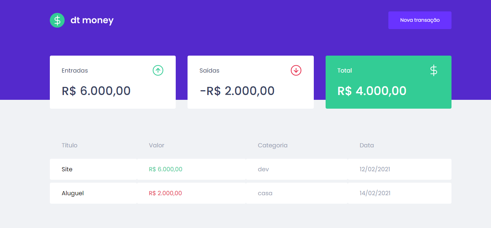
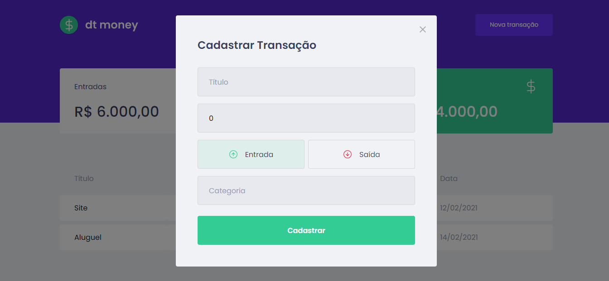

<h1 align="center">dt money</h1>

<h3 align="center">Uma aplição para controle financeiro, construida com React</h3>

  

  

## 💻 Projeto

O dtmoney é uma aplição financeira, onde você pode adicionar receitas e despesas que são armazenadas com a data que foram criadas, e calculadas para mostrar o resumo na tela. 

## ✨ Tecnologias e Bibliotecas 

Esse projeto foi desenvolvido com as seguintes tecnologias e bibliotecas:

- [React](https://pt-br.reactjs.org/)
- [TypeScript](https://www.typescriptlang.org/)
- [Miragejs](https://miragejs.com/)
- [Axios](https://github.com/axios/axios)
- [Polished](https://polished.js.org/)
- [Styled-components](https://styled-components.com/)

## 🚀 Como executar

- Clone o repositório e acesse a pasta;
- Instale as dependências com `yarn`;
- Inicie o servidor com `yarn start`;

A aplicação pode ser acessada em [`localhost:3000`](http://localhost:3000).

